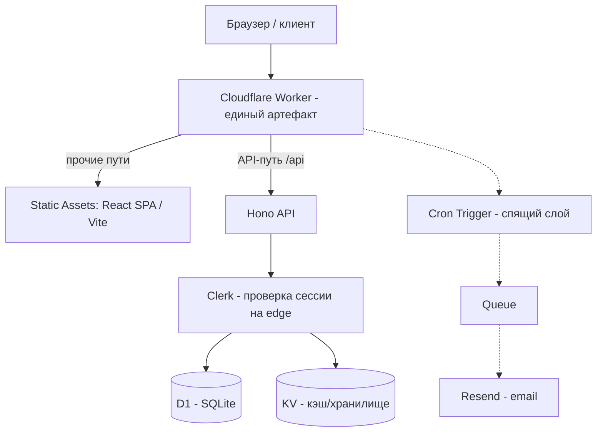

# Руководство разработчика — `dashboard-cf-hono-template`

> Практическое руководство для разработчиков, которые работают вместе со мной над
> дашбордами на этом шаблоне. Проза — на русском, команды и промпты — как есть
> (их нужно копировать без перевода). Работаем через Claude Code.
>
> ⚠️ Этот файл **в `.gitignore`** — он локальный командный помощник, а не часть
> публикуемого шаблона. Не коммитить.

## Оглавление

1. [Обзор проекта](#1-обзор-проекта)
2. [Зависимости для установки (macOS и Windows)](#2-зависимости-для-установки-macos-и-windows)
3. [Развёртывание нового проекта из шаблона (+ промпт для Claude)](#3-развёртывание-нового-проекта-из-шаблона)
4. [Ветка → изменения → merge через Claude (+ зачем это нужно)](#4-ветка--изменения--merge-через-claude)
5. [Новая версия с release notes (+ промпт для Claude)](#5-новая-версия-с-release-notes)
6. [Быстрый справочник команд](#6-быстрый-справочник-команд)

---

## 1. Обзор проекта

### Что это

`dashboard-cf-hono-template` — это **бренд-нейтральный GitHub Template**: стартовая
точка для любого нового дашборда Binatrix. Из него за минуты создаётся правильно
собранный, готовый к деплою проект на стеке Cloudflare — без ручной правки конфигов
и замены названий по всему коду.

Архитектурная суть: **один Cloudflare Worker** одновременно:

- отдаёт **Vite + React SPA** как **Static Assets** (на границе сети, бесплатно);
- маршрутизирует `/api/*` в **Hono**-API на том же рантайме (workerd);
- работает с **D1** (SQLite на границе) и **KV** (кэш / хранилище);
- проверяет аутентификацию **Clerk** прямо на edge;
- содержит «спящий» асинхронный слой **Cron → Queues → Resend** (по умолчанию выключен).

Раскладка — **single-package** (не монорепо): `src/client`, `src/server`,
`src/shared`, один `wrangler.jsonc`, один `pnpm dev`. Это официальная эталонная
раскладка Cloudflare 2026 года для «React SPA + API на одном Worker».

### Элементы проекта

| Путь | Что внутри |
|------|-----------|
| `src/client/` | React SPA. `routes/` — файловый роутинг TanStack (в т.ч. `_authenticated/` — защищённые страницы, `(auth)`, `(errors)`); `features/`; `components/ui/` (shadcn) + `components/layout/`; `hooks/`, `lib/`, `styles/`; `main.tsx`; `routeTree.gen.ts` — **генерируется, не редактировать**. |
| `src/server/` | Hono-API. `index.ts` — вход (указан в `wrangler.jsonc` → `main`); `routes/` (health, items, settings, users + рядом `.test.ts`); `middleware/require-auth.ts`; `db/` (Drizzle `schema.ts`, `queries.ts`); `async/` — спящий слой (handlers/messages/email). |
| `src/shared/` | Общий код клиента и сервера: `types.ts`, Zod-схемы (`settings.ts`). |
| `setup.mjs` | Интерактивный параметризатор шаблона (переименовывает worker/пакет/биндинги). |
| `wrangler.jsonc` | Конфиг единственного Worker: assets, D1, KV, vars, спящие cron/queues. |
| `migrations/` | SQL-миграции D1 (`0000_init.sql` + meta). |
| `docs/` | Руководства: adding-pages, data-layer, secrets, ui-components, async-layer, THEMING. |
| `.claude/skills/dashboard-dev/` | Единственный намеренно поставляемый скилл — рецепты работы с шаблоном. |

### 🔒 Контракт безопасности (запомнить)

Из скилла `dashboard-dev` — два инварианта, которые нельзя нарушать:

1. **Страница защищена только если** её роут лежит под
   `src/client/routes/_authenticated/` **И** её API-роутер смонтирован **после**
   `requireAuth` в `src/server/index.ts`. Порядок регистрации роутеров в
   `index.ts` — это и есть контракт безопасности (порядок = порядок проверки).
2. **Никогда** не редактировать `routeTree.gen.ts` (генерируется при `pnpm dev`/`build`)
   и **никогда** не запускать `drizzle-kit push` — только `db:generate` (миграции).

Порядок в `src/server/index.ts`: `health` (публичный) → `clerkMiddleware()` →
`requireAuth` → защищённые роутеры (`items`, `settings`, `users`) → терминальный
`app.all('/api/*', …404)`.

### Что именно деплоится в Cloudflare

Один Worker = весь артефакт:

| Компонент | Как задан |
|-----------|-----------|
| SPA-ассеты | биндинг `ASSETS`, `not_found_handling: "single-page-application"` |
| Hono `/api/*` | `run_worker_first: ["/api/*"]` (Worker вызывается до статики) |
| D1 | биндинг в коде — `DB` (имя ресурса задаётся в `setup.mjs`) |
| KV | биндинг в коде — `CACHE` |
| Clerk | `CLERK_PUBLISHABLE_KEY` — обычный `var`; `CLERK_SECRET_KEY` — **секрет** |
| Runtime | `compatibility_date: 2026-06-01`, флаг `nodejs_compat` |

### Диаграмма



Если рендер Mermaid недоступен — вот та же раскладка репозитория текстом:

```
dashboard-cf-hono-template/
├─ src/
│  ├─ client/        # React SPA (TanStack Router, shadcn/ui, Tailwind v4)
│  │  ├─ routes/
│  │  │  └─ _authenticated/   # защищённые страницы
│  │  └─ routeTree.gen.ts     # генерируется — НЕ трогать
│  ├─ server/        # Hono API
│  │  ├─ index.ts             # вход Worker (порядок роутеров = безопасность)
│  │  ├─ middleware/require-auth.ts
│  │  ├─ db/                  # Drizzle: schema.ts, queries.ts
│  │  └─ async/               # спящий слой Cron→Queue→Resend
│  └─ shared/        # общие Zod-схемы и типы
├─ migrations/       # SQL D1
├─ docs/             # руководства
├─ setup.mjs         # параметризатор шаблона
└─ wrangler.jsonc    # конфиг единственного Worker
```

---

## 2. Зависимости для установки (macOS и Windows)

Требования сверены с документацией Cloudflare. Поддерживаемые ОС для Wrangler:
**macOS 13.5+** и **Windows 11**.

### Общее для обеих ОС

| Инструмент | Версия / примечание |
|-----------|---------------------|
| **Node.js** | последняя **LTS**; проект пинит **Node 22** (см. `.nvmrc`). Wrangler v4 **не поддерживает** Node 16/18 — проверьте `node --version`. Ставить через менеджер версий (см. ниже). |
| **pnpm** | `10.25.0` (пин в `package.json` → `packageManager`). Проще всего: `corepack enable`, дальше pnpm подтянется автоматически. |
| **Wrangler** | `^4.105.0` — **уже в devDependencies** шаблона. Запускать **локально**: `pnpm wrangler …`, а не глобально. (Отдельно ставить не нужно; `pnpm install` подтянет.) |
| **git + GitHub CLI (`gh`)** | нужны для создания репозитория из шаблона и релизов. |
| **Аккаунты** | Cloudflare (для Workers/D1/KV) и Clerk (dev-инстанс, ключ `pk_test_…`). |

### macOS

```bash
# менеджер версий Node (nvm) + Node 22
brew install nvm            # либо см. инструкцию nvm; для Volta: brew install volta
nvm install 22 && nvm use 22

corepack enable             # включает pnpm
brew install gh             # GitHub CLI
```

- Прокси (корпоративная сеть): перед командой —
  `HTTP_PROXY=http://<host>:<port> pnpm wrangler dev`.

### Windows

```bash
# менеджер версий: nvm-windows (https://github.com/coreybutler/nvm-windows) либо Volta
nvm install 22
nvm use 22

corepack enable             # включает pnpm
winget install --id GitHub.cli   # GitHub CLI (или scoop/choco)
```

- Работаете **через WSL**? `pnpm wrangler login` может не открыть браузер — задайте
  `export BROWSER="/mnt/c/Program Files/…/browser.exe"`, указав путь к Windows-браузеру.
- Кастомные `build.command` в `wrangler.jsonc` на Windows выполняются в `cmd`
  (на macOS/Linux — в `sh`). Для нашего шаблона это неважно, но помните.

### Аутентификация Wrangler в Cloudflare

```bash
# Локальная разработка (интерактивно, OAuth — откроется браузер):
pnpm wrangler login

# CI / headless: через переменные окружения (без браузера):
export CLOUDFLARE_API_TOKEN=…      # Account API token
export CLOUDFLARE_ACCOUNT_ID=…
```

### Проверка окружения

```bash
node --version            # v22.x
pnpm --version            # 10.25.0
pnpm wrangler --version   # 4.x  (после pnpm install)
gh auth status            # авторизован в GitHub
```

---

## 3. Развёртывание нового проекта из шаблона

Новый дашборд создаётся из GitHub Template и параметризуется скриптом `setup.mjs`.

### Шаг 1 — создать репозиторий из шаблона

```bash
gh repo create <org>/<slug> \
  --template BinatrixAI/dashboard-cf-hono-template \
  --private --clone
cd <slug>
pnpm install
```

### Шаг 2 — параметризовать (`setup.mjs`)

Интерактивно (задаст вопросы в терминале):

```bash
node setup.mjs
```

Или headless (для Claude / CI) одной командой:

```bash
node setup.mjs --yes \
  --name <slug> \
  --app-name "<Отображаемое имя>" \
  --clerk-pk pk_test_… \
  --d1-name <slug>-db \
  --kv-title <slug>-cache
```

Что делает `setup.mjs`:
- подставляет все sentinel-имена `__NAME__` (worker, пакет, биндинги);
- генерирует `.dev.vars` (из `.dev.vars.example`) и `.env.local` для клиента;
- **жёстко падает**, если остался хоть один identifier-sentinel `__NAME__`;
- ID ресурсов вида `REPLACE_WITH_YOUR_*` (D1/KV) он **не** заполняет — это
  «оставшиеся действия», их подставляем на шаге 3.

### Шаг 3 — создать ресурсы и задать секрет

```bash
wrangler d1 create <slug>-db
# → скопировать database_id в wrangler.jsonc (заменить REPLACE_WITH_YOUR_D1_ID)

wrangler kv namespace create <slug>-cache
# → скопировать id в wrangler.jsonc (заменить REPLACE_WITH_YOUR_KV_ID)

wrangler secret put CLERK_SECRET_KEY     # вставить sk_test_… (в git НЕ попадает)

pnpm cf-typegen                          # перегенерировать типы Env из биндингов
pnpm db:migrate:remote                   # применить миграции к удалённой D1
```

> Локальная и удалённая D1 — **две разные** базы, они не синхронизируются.
> Для локальной разработки/тестов используйте `pnpm db:migrate:local`.

### Шаг 4 — деплой (основной путь: Cloudflare MCP + wrangler)

Наш основной способ — **гибрид Cloudflare MCP**: MCP управляет D1/KV/секретами/проверкой,
а сам артефакт (SPA-ассеты + Worker) публикуется через `wrangler deploy`.

Причина гибрида: SPA-сборка (`dist/`) — это ~3 МБ и 70+ файлов, песочница MCP не
может протолкнуть их за лимиты вызова, поэтому артефакт всегда идёт через wrangler.
D1/KV/секреты/сабдомен/верификация — через MCP.

```bash
pnpm build            # обязательный локальный шаг (собирает dist/)
wrangler deploy       # публикует ассеты + Worker → *.workers.dev
# (эквивалент: pnpm run deploy = pnpm build && wrangler deploy)
```

Порядок для секрета Clerk: сначала `wrangler deploy` (создаёт Worker) → потом
`wrangler secret put CLERK_SECRET_KEY` (применяется без повторного деплоя).

**Альтернативы (кратко):**
- Портативно и просто: `pnpm run deploy` целиком через wrangler CLI (без MCP).
- CI-автодеплой: один раз подключить репозиторий в Cloudflare → Workers & Pages →
  Builds (build `pnpm build`, deploy `wrangler deploy`); дальше пуш в `main` деплоит сам.

### 📋 Готовый промпт для Claude (создать + задеплоить проект)

Вставьте в новую сессию Claude Code, подставив значения в угловых скобках:

```
Создай и задеплой новый дашборд из шаблона dashboard-cf-hono-template.

Значения:
- slug (имя worker/пакета): <slug>
- отображаемое имя: <Отображаемое имя>
- Clerk publishable key: pk_test_<...>
- Clerk secret key: sk_test_<...>
- D1 name: <slug>-db
- KV title: <slug>-cache
- аккаунт Cloudflare: Binatrix (85b301e09d399a4c5cc4933d0ac9fd03)

Сделай по шагам:
1. pnpm install, затем node setup.mjs --yes с этими значениями.
2. Через Cloudflare MCP создай D1 (<slug>-db) и KV (<slug>-cache),
   подставь их ID в wrangler.jsonc вместо REPLACE_WITH_YOUR_*.
3. Задай секрет CLERK_SECRET_KEY (через MCP или wrangler secret put) — в git НЕ коммить.
4. pnpm cf-typegen; затем pnpm db:migrate:remote.
5. pnpm build && wrangler deploy.
6. Проверь живой *.workers.dev URL (главная страница + /api/health)
   и верни мне итоговый URL и статус проверки.
```

---

## 4. Ветка → изменения → merge через Claude

### Зачем это нужно

На общем клиентском проекте коммитить напрямую в `main` рискованно. Ветка + Pull
Request дают:

- **ревью** изменений человеком до попадания в прод;
- прогон **CI-гейта** (jobs `quality-gate`, `secret-scan`, `sentinel-scan`);
- **точку отката** — прод (деплой из `main`) не ломается недоведённой правкой.

### Стандартный поток

```bash
git checkout -b feature/<короткий-slug>
# … изменения …
pnpm typecheck && pnpm lint && pnpm test     # локальный гейт до пуша
git add -A && git commit -m "feat: …"
git push -u origin feature/<короткий-slug>
gh pr create --fill                          # открыть PR
# … ревью + зелёный CI …
gh pr merge --squash                         # merge в main → деплой ships main
```

- Секреты и `.dev.vars` в коммиты **не попадают** (уже в `.gitignore`).
- Хвост co-author в сообщениях коммитов — по нашей конвенции (см. настройки коммитов).

### 📋 Готовый промпт для Claude (ветка + PR)

```
Внеси изменение через отдельную ветку и Pull Request — НЕ коммить прямо в main.

Задача: <опиши, что нужно сделать>.

Шаги:
1. Создай ветку feature/<короткий-slug> от актуального main.
2. Внеси изменения.
3. Прогони pnpm typecheck && pnpm lint && pnpm test — все зелёные.
4. Сделай атомарные коммиты с внятными сообщениями.
5. Запушь ветку и открой PR (gh pr create) с кратким описанием:
   что менялось, зачем, как проверить.
6. НЕ делай merge сам — верни мне ссылку на PR и статус CI.
```

---

## 5. Новая версия с release notes

Когда разработчик внёс значимые изменения в **проекте** (обычный репозиторий,
созданный из шаблона) и нужно зафиксировать версию — используем стандартный
SemVer + GitHub Release.

> Примечание: сам репозиторий шаблона (`BinatrixAI/dashboard-cf-hono-template`)
> публикуется по особой внутренней схеме (snapshot-история — см. заметки
> мейнтейнера). К обычным проектам из шаблона это **не относится** — здесь всё
> стандартно.

### SemVer — как выбрать номер

- **MAJOR** (`v2.0.0`) — несовместимые изменения / ломающие правки.
- **MINOR** (`v1.3.0`) — новая функциональность без слома совместимости.
- **PATCH** (`v1.2.1`) — багфиксы и мелочи.

### Поток

```bash
# 1. поднять version в package.json (например 1.2.0 → 1.3.0), смёржить в main
# 2. тег на актуальном main:
git tag -a v1.3.0 -m "v1.3.0 — <кратко суть релиза>"
git push origin v1.3.0

# 3. GitHub Release с заметками:
gh release create v1.3.0 \
  --title "v1.3.0 — <название>" \
  --notes "$(...)"           # либо --generate-notes для авто-заметок из коммитов

# 4. задеплоить прод (см. §3, шаг 4)
```

### 📋 Готовый промпт для Claude (выпуск версии)

```
Выпусти новую версию проекта.

Тип изменений: <major|minor|patch> — <почему>.

Шаги:
1. Определи следующий номер по SemVer и подними "version" в package.json.
2. Собери release notes из коммитов с прошлого тега, сгруппируй как
   Added / Changed / Fixed (кратко, по-человечески).
3. Смёржи бамп версии в main, поставь аннотированный тег vX.Y.Z и запушь тег.
4. Создай GitHub Release (gh release create) с этими заметками.
5. Задеплой прод: pnpm build && wrangler deploy, проверь живой URL.
6. Верни мне ссылку на релиз и итоговый URL.
```

---

## 6. Быстрый справочник команд

| Команда | Что делает |
|---------|-----------|
| `pnpm dev` | локальный dev-сервер (SPA HMR + Worker в workerd) |
| `pnpm build` | сборка (`tsc -b && vite build`) → `dist/` |
| `pnpm run deploy` | `pnpm build && wrangler deploy` |
| `pnpm typecheck` | `tsc -b` |
| `pnpm lint` / `pnpm format` | ESLint / Prettier |
| `pnpm test` | Vitest (в workerd, с моками биндингов) |
| `pnpm db:generate` | сгенерировать SQL-миграцию из Drizzle-схемы |
| `pnpm db:migrate:local` | применить миграции к **локальной** D1 |
| `pnpm db:migrate:remote` | применить миграции к **удалённой** D1 |
| `pnpm cf-typegen` | перегенерировать типы `Env` из биндингов |
| `wrangler secret put <NAME>` | задать секрет (в git не попадает) |
| `wrangler d1 create <name>` / `wrangler kv namespace create <title>` | создать ресурсы |

### Дальше по темам (в `docs/`)

- `docs/adding-pages.md` — добавление страниц, роутов и API-эндпоинтов.
- `docs/data-layer.md` — слой данных: D1 + KV.
- `docs/secrets.md` — секреты и переменные окружения (4 механизма).
- `docs/ui-components.md` — компоненты shadcn/ui (CLI + MCP).
- `docs/async-layer.md` — активация спящего слоя Cron → Queues → Resend.
- `docs/THEMING.md` — темизация (tweakcn + Tailwind v4).
- `.claude/skills/dashboard-dev/SKILL.md` — рецепты работы с шаблоном для Claude.
